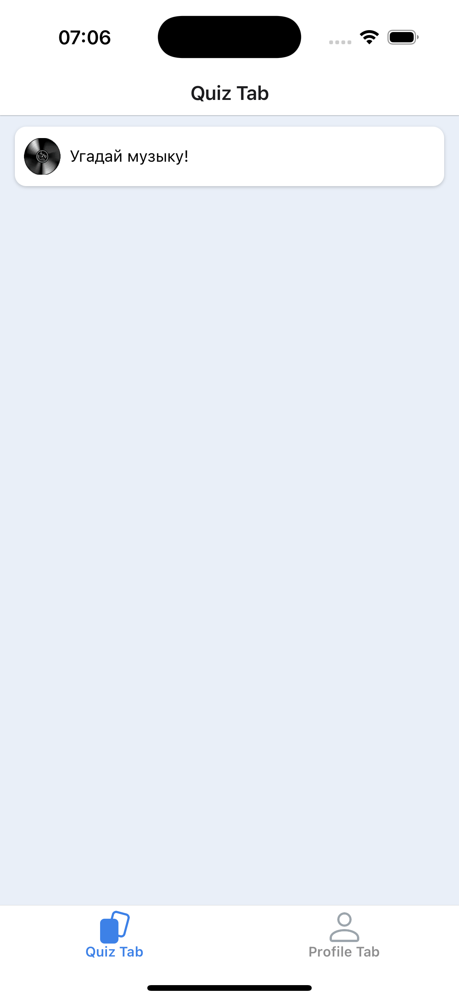
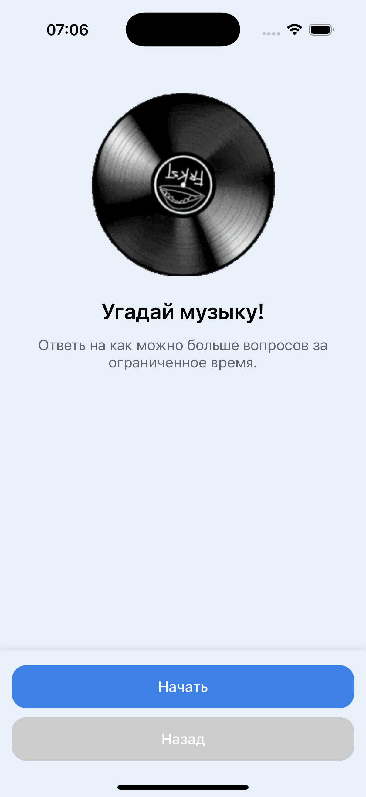
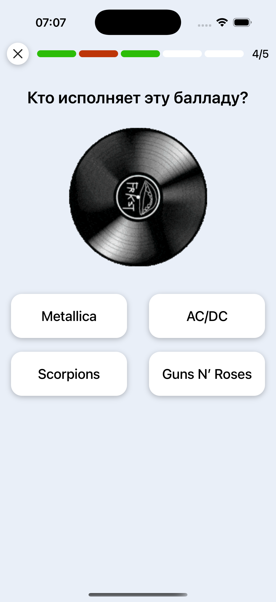
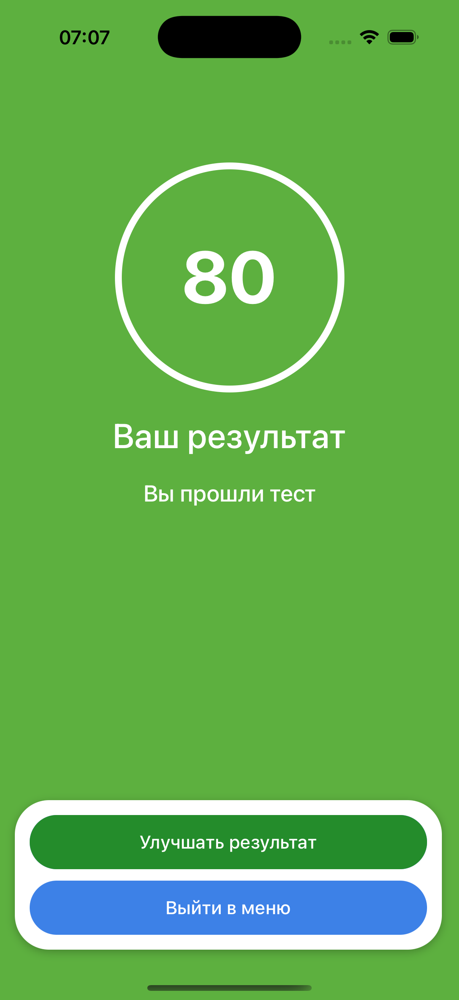

# 🚀 Начало работы с проектом на React Native (Expo)

## 📦 Установка зависимостей

Перед запуском убедитесь, что у вас установлен Node.js и npm. Затем в корне проекта выполните установку зависимостей:

```sh
npm install
```

## 🛠️ Запуск Metro Bundler

Metro — это JavaScript-сборщик, используемый в React Native. Чтобы запустить Metro-сервер, выполните:

```sh
npx expo start
```

## 🔥 Очистка кеша с помощью npx expo start -c

Если вы столкнулись с ошибками или багами, связанными с кешированием, вы можете очистить кеш Metro-сервера перед запуском с помощью следующей команды:

```sh
npx expo start -c

```

После запуска вы увидите QR-код. Отсканируйте его с помощью приложения **Expo Go** на вашем мобильном устройстве или откройте в эмуляторе/симуляторе.

## 📱 Запуск на устройстве

- **Android**: нажмите `a` в терминале, чтобы открыть в Android-эмуляторе.
- **iOS**: нажмите `i`, чтобы открыть в симуляторе iOS (только на macOS).
- **В браузере**: нажмите `w`, чтобы открыть веб-версию приложения.

## 🖼️ Скриншоты

<div style="display: flex; overflow-x: scroll; gap: 10px;">
  
  
</div>

&nbsp;&nbsp;&nbsp;

<div style="display: flex; overflow-x: scroll; gap: 10px;">
  
  
</div>

## 🎥 Видео

### Пример работы приложения

<video  width="350" controls>
  <source src="https://raw.githubusercontent.com/ekosh02/SimpleQuiz/main/readmeAssets/Record1.MP4" type="video/MP4">
</video>
